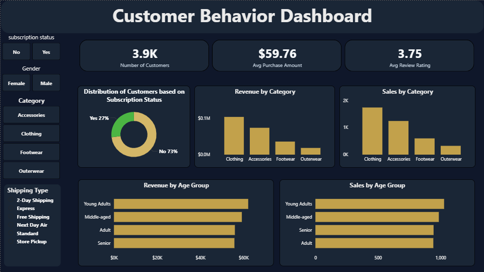

# Customer Shopping Behavior - Analysis and Dashboard
_A data-driven analysis of customer shopping behavior using Python, SQL, and Power BI to uncover key purchasing patterns and business insights._

---
## Table of Contents
- <a href="#overview">Overview</a>
- <a href="#business-problem">Business Problem</a>
- <a href="#dataset">Dataset</a>
- <a href="#tools--technologies">Tools & Technologies</a>
- <a href="#data-cleaning--preparation">Data Cleaning & Preparation</a>
- <a href="#data-analysis-using-sql">Data Analysis using SQL</a>
- <a href="#dashboard">Dashboard</a>
- <a href="#how-to-run-this-project">How to Run This Project</a>
- <a href="#business-recommendations">Business Recommendations</a>
- <a href="#author--contact">Author & Contact</a>

---
<h2>Overview</h2>

This project analyzes customer shopping behavior to identify spending patterns, product performances, discount impact, and demographic trends. It combines data cleaning, exploratory analysis, and feature engineering in Python; tructured business queries in SQL for deeper insight; and an interactive Power BI dashboard to present clear, actionable findings for data-driven decision-making.

---
<h2>Business Problem</h2>

- The business requires a clear understanding of how distinct customer segments interact with products and make purchase decisions.
- It is essential to identify the key drivers influencing customer spending behavior.
- The organization needs insight into which products, discount strategies, and behavioral patterns contribute most significantly to overall revenue.

---
<h2>Dataset</h2>

- The dataset consists of 3,900 customer transactions
- It includes following key features:
    - Customer Demographics: Age, Gender, Location, Subscription status.
    - Purchase Details: Item Purchased, Category, Purchase Amount, Season, Size, Color. 
    - Shopping Behavior: Discount Applied, Promo Code Used, Previous Purchases, Frequency 
of Purchases, Review Rating, Shipping Types.

---
<h2>Tools & Technologies</h2>

- Python
- SQL
- Power BI
- Gitub

---
<h2>Data Cleaning and Preparatiom</h2>

- Handling Missing Values: Identified null entries and addressed missing values in the review_rating column by imputing the median rating within each product category to preserve segment-level accuracy.
- Column Standerdization: Reanmed all column headers to snake case to ensure consistent formatting, redability, and ease of referance across the analysis.
- Feature Engineering:
    - Created an age_group feature by binning customer ages into defined demographic ranges.
    - Developed purchase_frequency_days by converting textual purchase intervals (e.g., Weekly, Quarterly, Annually) into standardized numeric values measured in days.
- Data Consistency Check: Identified redundancy between discount_applied and promo_code_used and removed the latter to avoid duplication.
- Database Integration: Connected the cleaned dataset to PostgreSQL and loaded it into a structured database table to enable advanced SQL-based analysis and business querying.

---
<h2>Data Analysis using SQL</h2>
Conducted structured analysis in PostgreSQL to address key business questions and extract actionable insights.
The following business questions were answered using SQL:

1. What is the total revenue generated by male vs. female customers?
2. Which customer used a discount but still spent more than the average purchase amount?
3. What are the top 5 products with the highest average rating?
4. Compare the average Purchase Amounts between Standard and Express Shiping.
5. Do subscribed customersspend more? compare average spend and total revenue between subscribers and non-subscribers.
6. What 5 products have the highest percentage of purchases with discounts applied?
7. Segment Customers into New, Returning, and Loyal based on their total number of previous purchases, and show the count of each segment.
8. What are the top 3 most purchased product with each catrgory?
9. Which custoemrs are repeat buyers (more than 5 previous purchases) also likely to subscribe?
10. What is the revenue contribution of each age group?

---
<h2>Dashboard</h2>

- Power BI dashboard shows
    - Key Customer KPIs: Displays total customers (3.9K), average purchase amount, and average review rating to provide a quick overview of customer value and satisfaction.
    - Subscription Insights: A donut chart shows the proportion of customers with and without subscriptions, highlighting that the majority are non-subscribers.
    - Revenue by Category: A bar chart compares revenue across product categories, helping identify top-performing categories.
    - Sales Volume by Category: Shows the number of units sold across categories, enabling comparison between product demand and revenue generation.
    - Revenue by Age Group: Highlights how different age groups contribute to total revenue, revealing high-value customer groups.
    - Sales by Age Group: Breaks down total units sold by age groups to identify which demographic purchases the most frequently.
    - Interactive Slicers: Filters for subscription status, gender, category, and shipping type allow users to dynamically explore customer segments and refine insights.

---
<h2>How to Run This Project</h2>

1. Clone the repository:
``

2. Open the Jupyter Notebook
This notebook contains the full Python workflow, including:
- Initial data exploration
- Data cleaning and preprocessing
- Feature engineering
- Handling missing values
- Removing redundant features
- Exporting the cleaned dataset to PostgreSQL

3.  Load Data into the SQL Database
Inside the notebook, follow the steps to:
- Connect to PostgreSQL
- Create the required database and table
- Load the cleaned dataframe into SQL for further analysis

4. Run SQL Queries
Run the queries in PostgreSQL to reproduce all analytical tables and insights.

5. Open the Power BI Dashboard
Use Power BI Desktop to view the interactive dashboard.

6. Review the Project Report
The report contains:
- Business problem and objectives
- Full analysis summary
- SQL outputs and visuals
- Dashboard insights
- Final recommendations

---
<h2>Business Recommendations</h2>

- Product Positioning: Highlight top-rated and best-selling products in marketing campaigns 
to drive higher conversions.
- Targeted Marketing: Concentrate marketing efforts on high-revenue age groups and 
customers who prefer express shipping.
- Boost Subscription Rates: Promote exclusive benefits to encourage more customers to 
subscribe. 
- Customer Loyalty Programs: Introduce targeted rewards for repeat buyers to encourage 
their progression into the “Loyal” segment.
- Review Discount Policy: Balance sales growth from discounts with margin control to ensure 
profitability.

---
<h2>Author & Contact</h2>

**Shivam Powar**

📧 Email: shivampowar.sp4531@gmail.com

🔗[LinkedIn](www.linkedin.com/in/shivam-powar-45s31)

🔗[GitHub](https://github.com/ShivamKPowar)
